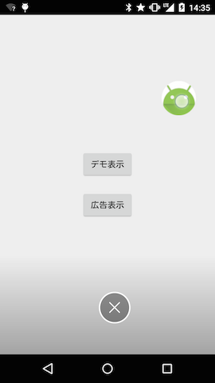
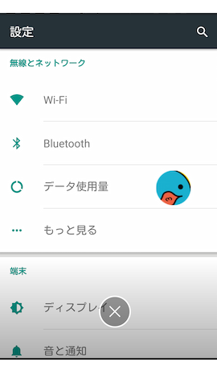

# FloatingView
[Archived] Use instead: https://developer.android.com/guide/topics/ui/bubbles

The Android project is View to display information such as chat in front.
To API Level 14 or higher are supported

## Screenshots
  



  
*Watch YouTube video*  
[SimpleFloating](http://youtu.be/nb8M2p0agF4)

## Requirements
Target Sdk Version : 28  
Min Sdk Version : 14  

## How to use
1) Add this to your **build.gradle**.
  ```java
  repositories {
      maven {
          url "https://jitpack.io"
      }
  }

  dependencies {
    implementation 'com.github.recruit-lifestyle:FloatingView:2.4.4'
  }
  ```
  
2) Implement Service for displaying FloatingView
```java
public class ChatHeadService extends Service {
  ... ...
}
```
  
3) You will do the setting of the View to be displayed in the FloatingView(Sample have a set in onStartCommand)
```java
  final LayoutInflater inflater = LayoutInflater.from(this);
  final ImageView iconView = (ImageView) inflater.inflate(R.layout.widget_chathead, null, false);
  iconView.setOnClickListener(......);
```  

4) Use the FloatingViewManager, make the setting of FloatingView
```java
  mFloatingViewManager = new FloatingViewManager(this, this);
  mFloatingViewManager.setFixedTrashIconImage(R.drawable.ic_trash_fixed);
  mFloatingViewManager.setActionTrashIconImage(R.drawable.ic_trash_action);
  final FloatingViewManager.Options options = new FloatingViewManager.Options();
  options.overMargin = (int) (16 * metrics.density);
  mFloatingViewManager.addViewToWindow(iconView, options);
```  

The second argument of `FloatingViewManager` is `FloatingViewListener`
  
Describe the process (`onFinishFloatingView`) that is called when you exit the FloatingView
```java
    @Override
    public void onFinishFloatingView() {
        stopSelf();
    }
```
  
5) Add the permission to AndroidManifest
```xml
 <uses-permission android:name="android.permission.SYSTEM_ALERT_WINDOW"/>
 <uses-permission android:name="android.permission.FOREGROUND_SERVICE" />
```  
  
6) Define the Service to AndroidManifest

example)
```java
    <application ...>
        ...
        <!-- Demo -->
        <service
            android:name="jp.co.recruit_lifestyle.sample.service.ChatHeadService"
            android:exported="false"/>
        ...
    </application>
```
  
7) Describe the process to start the Service (run on foreground)


example)  

- FloatingViewControlFragment.java  

```java
    final Intent intent = new Intent(activity, ChatHeadService.class);
    ContextCompat.startForegroundService(activity, intent);
```

- ChatHeadService.java  

```java
public int onStartCommand(Intent intent, int flags, int startId) {
    ...
    startForeground(NOTIFICATION_ID, createNotification(this));
    ...
}
```

8) Create notification channel (targetSdkVersion >= 26)

example)
```java
if (Build.VERSION.SDK_INT >= Build.VERSION_CODES.O) {
    final String channelId = getString(R.string.default_floatingview_channel_id);
    final String channelName = getString(R.string.default_floatingview_channel_name);
    final NotificationChannel defaultChannel = new NotificationChannel(channelId, channelName, NotificationManager.IMPORTANCE_MIN);
    final NotificationManager manager = (NotificationManager) getSystemService(NOTIFICATION_SERVICE);
    if (manager != null) {
        manager.createNotificationChannel(defaultChannel);
    }
}

```

9) Add DisplayCutout process(API Level >= 28)

Call `FloatingViewManager.findCutoutSafeArea(activity)`.  
Note: Activity must be portrait oriented.  
Note: You must not set `windowLayoutInDisplayCutoutMode` to `never`.  

example)

- FloatingViewControlFragment.java

```java
final Intent intent = new Intent(activity, ChatHeadService.class);
intent.putExtra(ChatHeadService.EXTRA_CUTOUT_SAFE_AREA, FloatingViewManager.findCutoutSafeArea(activity));
ContextCompat.startForegroundService(activity, intent);
```

- ChatHeadService.java

```java
mFloatingViewManager.setSafeInsetRect((Rect) intent.getParcelableExtra(EXTRA_CUTOUT_SAFE_AREA));
```


## Static Options
It can be set only when displaying for the first time
  
example)
```java
final FloatingViewManager.Options options = new FloatingViewManager.Options();
options.overMargin = (int) (16 * metrics.density);
mFloatingViewManager.addViewToWindow(iconView, options);
```

|Option|Description|  
|:-:|---|  
|shape|`FloatingViewManager.SHAPE_CIRCLE`:Circle(default)<br> `FloatingViewManager.SHAPE_RECTANGLE`:Rectangle|  
|overMargin|Margin over the edge of the screen (px)<br>(default) 0|  
|floatingViewX|X coordinate of initial display<br>(default) left side of display|  
|floatingViewY|Y coordinate of initial display<br>(default) top of display|  
|floatingViewWidth|FloatingView width<br>(default) The width of the layout added to FloatingView |  
|floatingViewHeight|FloatingView height<br>(default) The height of the layout added to FloatingView|  
|moveDirection|`FloatingViewManager.MOVE_DIRECTION_DEFAULT`:Left end or right end(default)<br> `FloatingViewManager.MOVE_DIRECTION_LEFT`:Left end<br>`FloatingViewManager.MOVE_DIRECTION_RIGHT`:Right end<br>`FloatingViewManager.MOVE_DIRECTION_NONE`:Not move<br>`FloatingViewManager.MOVE_DIRECTION_NEAREST`:Move nearest edge<br>`FloatingViewManager.MOVE_DIRECTION_THROWN`:Move in the throwing direction (left end or right end)|
|usePhysics|Use physics-based animation(depends on `moveDirection`)<br>(default) true<br>Info:If `MOVE_DIRECTION_NEAREST` is set, nothing happens<br>Info:Can not be used before API 16|
|animateInitialMove|If true, animation when first displayed<br>(FloatingViewX, floatingViewY) to screen edge<br>Info: If `MOVE_DIRECTION_NONE` is set, nothing happens|  

## Dynamic Options
It can be set any time  
  
example)
```java
mFloatingViewManager.setFixedTrashIconImage(R.drawable.ic_trash_fixed);
mFloatingViewManager.setActionTrashIconImage(R.drawable.ic_trash_action);
```

|Option|Description|
|:-:|---|
|setFixedTrashIconImage|It is an icon that does *not* enlarge when FloatingView overlaps.|
|setActionTrashIconImage|It is an icon that enlarge when FloatingView overlaps.|
|setDisplayMode|`FloatingViewManager.DISPLAY_MODE_SHOW_ALWAYS`:Always show<br>`FloatingViewManager.DISPLAY_MODE_HIDE_ALWAYS`:Always hidden<br>`FloatingViewManager.DISPLAY_MODE_HIDE_FULLSCREEN`:It is hidden when in full screen|
|setTrashViewEnabled|If false, the trash icon does not show during dragging.<br>(default) true|

# Credits

FloatingView is owned and maintained by [RECRUIT LIFESTYLE CO., LTD.](http://www.recruit-lifestyle.co.jp/)

FloatingView was originally created by [Yoshihide Sogawa](https://twitter.com/egg_sogawa)  


# License

    Copyright 2015 RECRUIT LIFESTYLE CO., LTD.

    Licensed under the Apache License, Version 2.0 (the "License");
    you may not use this file except in compliance with the License.
    You may obtain a copy of the License at

       http://www.apache.org/licenses/LICENSE-2.0

    Unless required by applicable law or agreed to in writing, software
    distributed under the License is distributed on an "AS IS" BASIS,
    WITHOUT WARRANTIES OR CONDITIONS OF ANY KIND, either express or implied.
    See the License for the specific language governing permissions and
    limitations under the License.

